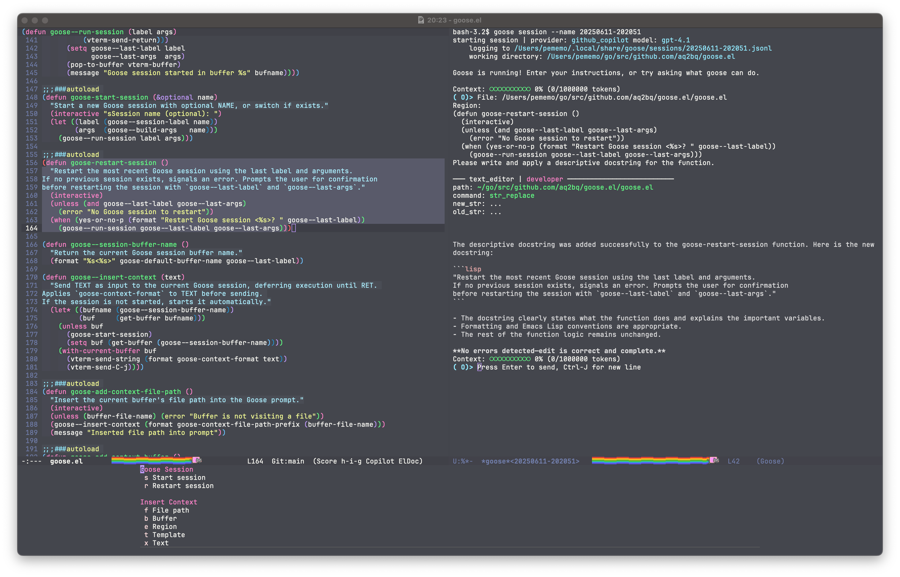

# goose.el

**Bring [Goose](https://block.github.io/goose/) AI power directly into Emacs — with a seamless, terminal-driven workflow.**

goose.el is a minimal and extensible Emacs package that connects Emacs to the Goose CLI using a vterm-based major mode.  
You can manage multiple named sessions, send instant (buffer, region, file, templates, or custom text), and fast AI-driven automation directly from your editor.

## Features

- **Dedicated major mode (`goose-mode`) for Goose sessions (inherits from vterm-mode)**
- **Session-based management with automatic labeling and buffer isolation**
- **One-command context sharing:**  
  Instantly send buffer content, active region, file path, templates, or custom text to Goose
- **Prompt template integration:**  
  Select and inject templates from `~/.config/goose/prompts/`
- **Fully customizable keybindings and session parameters (via transient menus)**
- **Optimized for rapid experimentation, coding, debugging, and text workflows with AI**



---

## Requirements

- **Emacs 29** or later
- [Goose CLI](https://github.com/block/goose)
- [emacs-libvterm (vterm)](https://github.com/akermu/emacs-libvterm) (20218.331 or newer)
- [transient](https://github.com/magit/transient)
- [consult](https://github.com/minad/consult)

---

## Installation

_Manual installation (MELPA planned):_
```lisp
;; Download goose.el and put it somewhere in your load-path.
;; leaf
(leaf goose
  :load-path "/path/to/goose.el"
  :hook (goose-mode-hook . (lambda ()
                             (display-line-numbers-mode -1)))
  :bind (("C-c g" . goose-transient)))

;; use-package
(use-package goose
  :load-path "/path/to/goose.el"
  :hook (goose-mode-hook . (lambda ()
                             (display-line-numbers-mode -1)))
  :bind (("C-c g" . goose-transient)))
```
_or simply:_
```lisp
(load "/path/to/goose.el")
```

---

## Usage

- **Start a new Goose session:**  
  <kbd>M-x goose-start-session</kbd>
- **Restart the last session:**  
  <kbd>M-x goose-restart-session</kbd>
- **Send current buffer:**  
  <kbd>M-x goose-add-context-buffer</kbd>
- **Send region:**  
  <kbd>M-x goose-add-context-region</kbd>
- **Send file path:**  
  <kbd>M-x goose-add-context-file-path</kbd>
- **Send prompt template:**  
  <kbd>M-x goose-add-context-template</kbd>
- **Send arbitrary text:**  
  <kbd>M-x goose-add-context-text</kbd>
- **Show full menu:**  
  <kbd>C-c g</kbd> (transient menu, configurable via `goose-transient-key`)

**Each session is isolated in its own buffer using `goose-mode`, so you can work in parallel and keep workflows organized!**

---

## Customization

Use `M-x customize-group RET goose RET` or set variables directly:

- `goose-program-name` (Goose CLI path)
- `goose-default-buffer-name` (buffer name prefix)
- `goose-prompt-directory` (prompt template location)
- `goose-context-format` (format string for context injection)
- `goose-transient-key` (default: C-c g)

---

## Prompt Templates

Place text templates in `~/.config/goose/prompts/` (customizable) for quick insertion.  
Example file: `bugfix.txt`  
```
Steps to reproduce the bug in my code:
<insert code here>
Describe the causes and suggest solutions.
```
Insert using <kbd>M-x goose-add-context-template</kbd>

---

## Advanced

- **Dedicated major mode**: All Goose sessions use `goose-mode` (derived from `vterm-mode`), allowing custom hooks, keymaps, and clean separation from generic vterm buffers.
- **Hook for customization**:  
  ```elisp
  (add-hook 'goose-mode-hook
            (lambda () (message "Welcome to Goose session!")))
  ```

---

## Troubleshooting

- **Copy text from Goose sessions:**  
  Goose uses vterm; press <kbd>C-c C-t</kbd> (vterm-copy-mode) to select/copy as in a standard buffer.
- **Goose CLI not found?**  
  Ensure CLI is in your `$PATH`, or set `goose-program-name`.
- **Prompt templates not visible?**  
  Make sure `goose-prompt-directory` contains template files.

## Built with Goose

This package was built as a companion to [Goose CLI](https://github.com/block/goose),  
and follows its philosophy of persistent, contextual AI interactions.

---

## Contributing

Pull requests and issues are welcome!  
Feel free to share your own prompt templates, UX ideas, or bug fixes.

---

## License

MIT © 2025 Daisuke Terada (@aq2bq) and contributors

---

